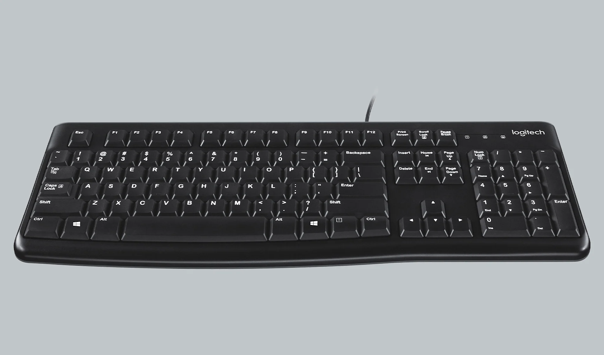
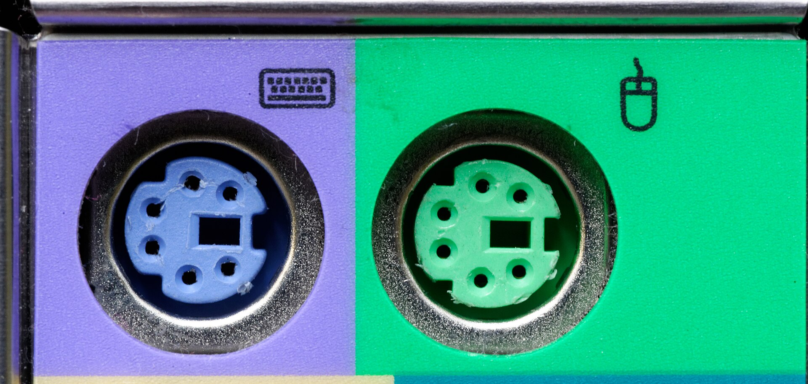
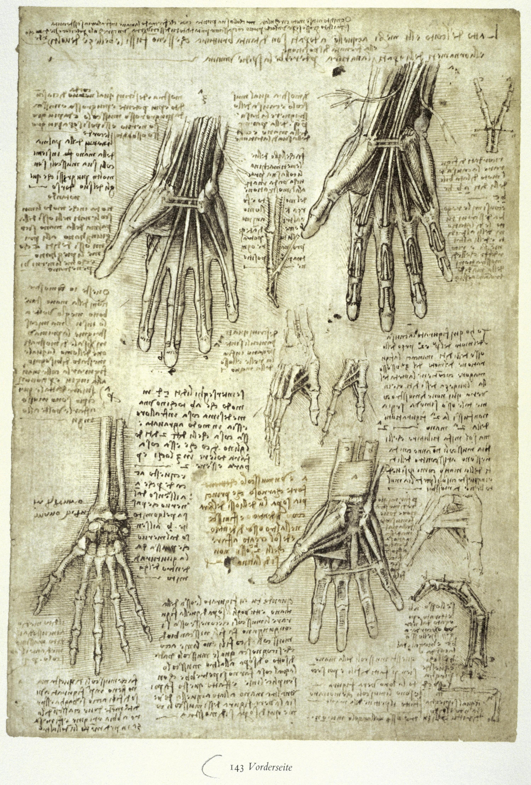
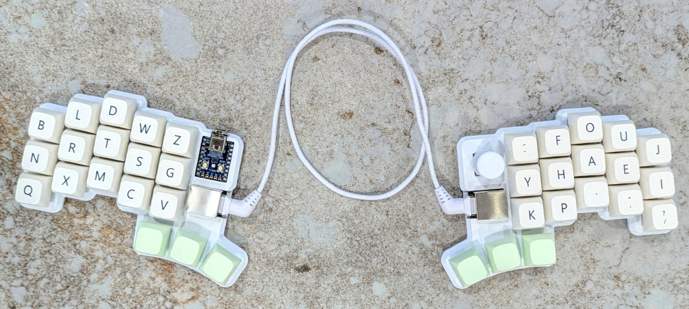
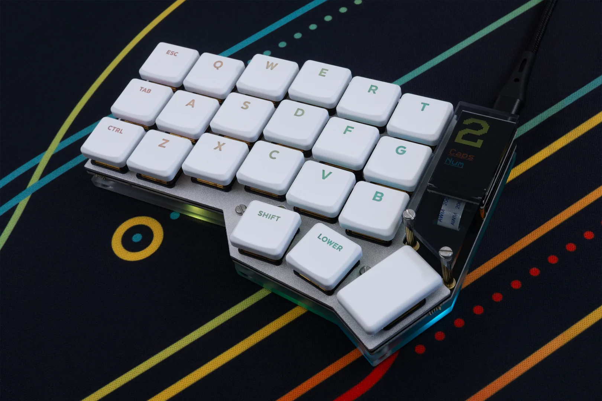
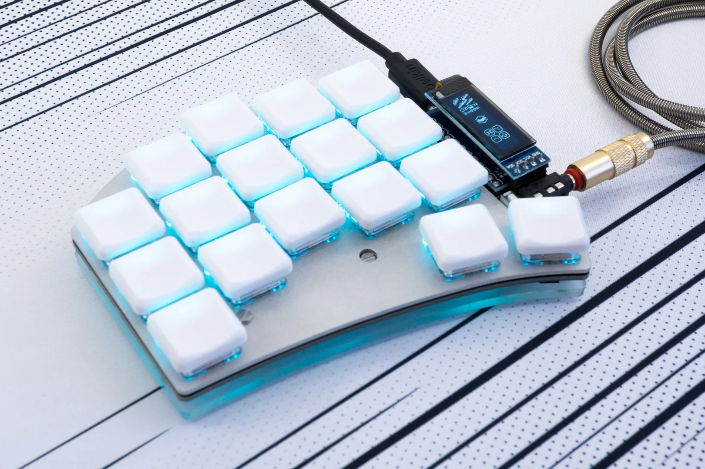
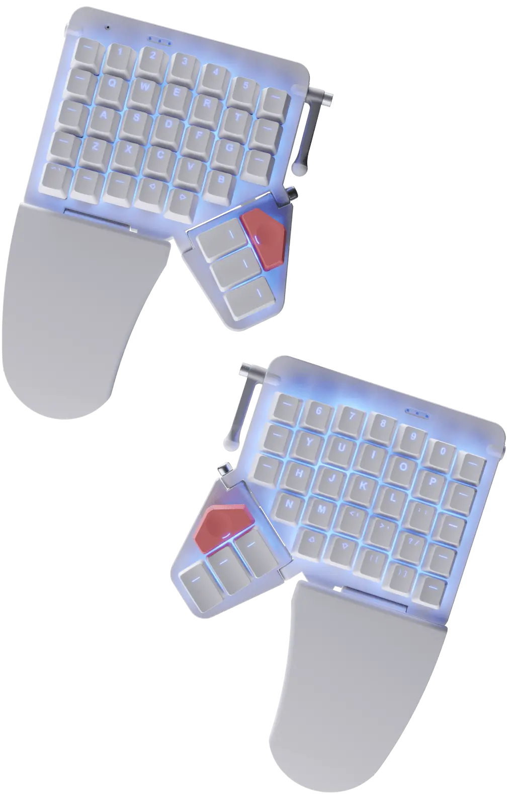
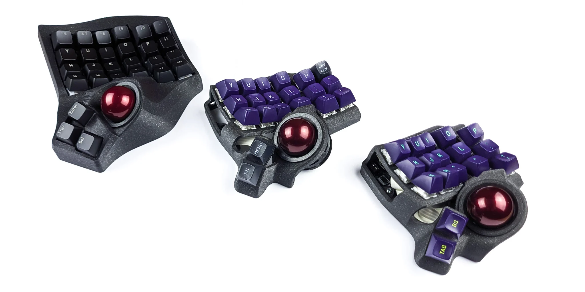
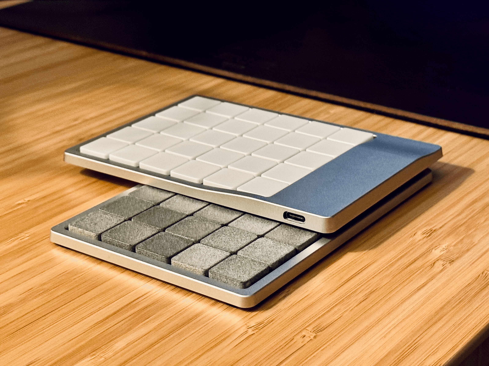
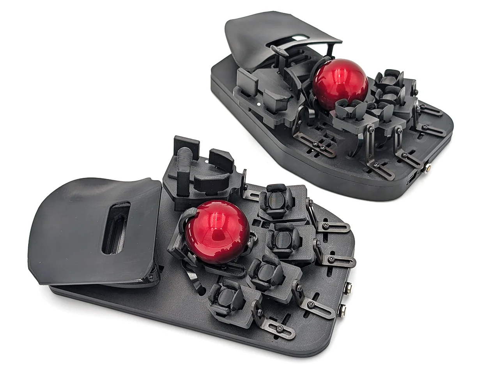

# Reprogrammer son clavier

D'AZERTY au split : ergonomie, configuration et assemblage

  Victor Voisin · Jeudi 8 octobre 2026 · 12h15

<!--
Laisser le titre respirer. Ne pas commencer à parler tout de suite.
-->

---

# Vous connaissez tous ça.

  

<!--
Commencer en silence. Laisser l'image parler.
"Vous avez tous ça sur votre bureau, ou quelque chose qui y ressemble."
-->

---

# Et peut-être ça aussi.

  

<!--
Demander à la salle: "Y'a des gamers parmi nous ?"
-->

---

# Et les plus anciens se souviendront...

  

La prise verte. La prise violette. Le bon vieux PS/2.

<!--
Pause nostalgie. Laisser les gens sourire.
"C'est l'outil qu'on utilise 8h par jour, qu'on ne choisit presque jamais, et auquel on ne pense jamais."
-->

---
layout: center
class: text-center
---

# Pourquoi parler de claviers ?

  C'est notre interface principale avec l'ordinateur.

  Des milliers de frappes par jour, pendant des années.

  Et pourtant, on ne choisit presque jamais ce qu'on utilise.

<!--
Transition vers la section suivante.
"On va voir pourquoi ça mérite qu'on s'y intéresse — et ce qu'on peut faire."
-->

---
layout: two-cols
---

# 1873.

  
Christopher Latham Sholes invente la machine à écrire commerciale.

  
Il conçoit le layout <strong>QWERTY</strong> pour résoudre un problème mécanique : éviter que les marteaux adjacents se coincent.

  
Pas pour la vitesse. Pas pour le confort. Pour la <em>mécanique</em>.

::right::

  

    📷 machine à écrire Sholes & Glidden 1873
  

<!--
"Le clavier qu'on utilise aujourd'hui a 150 ans. Il a été conçu pour éviter un problème mécanique qui n'existe plus depuis l'invention du clavier électronique."
-->

---

# Le row stagger : un héritage mécanique

  

    

      📷 vue de dessous machine à écrire — tiges des marteaux
    

    
Les tiges s'entrecroisent en diagonale

  

  
→

  

    

      📷 clavier moderne — rangées décalées
    

    
On a gardé le décalage... sans les tiges

  

<!--
"Les rangées de touches sont décalées entre elles — pas parce que c'est ergonomique, mais parce que les tiges mécaniques des marteaux s'organisaient en diagonale. On a retiré les tiges, on a gardé le décalage."
-->

---
layout: center
class: text-center
---

# Nos mains s'adaptent à l'outil.

Pas l'inverse.

  

    
Ce qu'on fait naturellement

    <ul class="text-gray-400 space-y-1">
      <li>Poignets dans l'axe des avant-bras</li>
      <li>Doigts qui tombent verticalement</li>
      <li>Mains légèrement écartées</li>
    </ul>
  

  

    
Ce que le clavier standard impose

    <ul class="text-gray-400 space-y-1">
      <li>Poignets en pronation forcée</li>
      <li>Doigts en diagonale (row stagger)</li>
      <li>Mains rapprochées sur un bloc</li>
    </ul>
  

<!--
"Sur la durée : tensions, TMS, syndrome du canal carpien. Et tout ça pour un design qui date de 1873 et qui résolvait un problème qui n'existe plus."
Transition : "Alors qu'est-ce qu'on peut faire ?"
-->

---
layout: center
class: text-center
---

# Il existe une alternative.

Le clavier custom.

  Choisir chaque composant. Adapter à sa morphologie. Programmer ses raccourcis.

<!--
Transition vers la section anatomie / panorama technique.
"Voyons d'abord de quoi est fait un clavier — pour comprendre ce qu'on peut changer."
-->

---
layout: center
class: text-center
---

# Un clavier, c'est 5 composants.

  

    
📐

    
Format

    
nombre de touches

  

  

    
🔘

    
Switches

    
le mécanisme de frappe

  

  

    
🔲

    
Keycaps

    
les capuchons

  

  

    
🧠

    
Controller

    
le cerveau

  

  

    
💾

    
Firmware

    
la programmation

  

<!--
"Chacun de ces composants est un choix. Et chaque choix a des implications sur le confort, le son, le prix, et les fonctionnalités."
-->

---

# Format : combien de touches ?

  

    Full size
    

    ~104
  

  

    TKL
    

    ~87
  

  

    65%
    

    ~68
  

  

    60%
    

    ~61
  

  

    Split 36–42
    

      ⬅ main gauche
    

    

      main droite ➡
    

  

Moins de touches = moins de déplacement = mains qui restent en position.

<!--
"On croit souvent qu'on a besoin de toutes ces touches. En pratique, avec des layers, 42 touches couvrent tout — et les mains bougent beaucoup moins."
-->

---
layout: two-cols
---

# Switches : le mécanisme de frappe

  

    
Membrane

    
Une membrane en caoutchouc sous les touches. Silencieux, peu cher, peu de retour tactile. Le standard des claviers d'entreprise.

  

  

    
Mécanique

    
Un switch individuel par touche. Trois familles :

    <ul class="text-sm text-gray-400 mt-1 space-y-1">
      <li><strong class="text-white">Linéaire</strong> — frappe fluide, pas de clic (ex: Red)</li>
      <li><strong class="text-white">Tactile</strong> — retour physique sans clic sonore (ex: Brown)</li>
      <li><strong class="text-white">Clicky</strong> — retour tactile + sonore (ex: Blue)</li>
    </ul>
  

  

    
MX vs Choc

    
MX = hauteur standard. Choc (Kailh) = low profile, clavier plus plat, compatibilité split.

  

::right::

  

    📷 switch MX en coupe
  

  

    📷 switch Choc low profile
  

<!--
"Le switch, c'est ce qui donne au clavier son feeling. C'est souvent la première chose qu'on personnalise — et c'est aussi ce qu'on peut changer avec le hotswap, on en reparlera."
-->

---
layout: two-cols
---

# Keycaps : les capuchons

  

    
Matière

    <ul class="text-sm text-gray-400 space-y-1 mt-1">
      <li><strong class="text-white">ABS</strong> — brillant avec le temps, moins cher</li>
      <li><strong class="text-white">PBT</strong> — mat, plus résistant, son plus sourd</li>
    </ul>
  

  

    
Profil (la hauteur et la forme)

    <ul class="text-sm text-gray-400 space-y-1 mt-1">
      <li><strong class="text-white">OEM / Cherry</strong> — profil sculpté, rangées à hauteur différente</li>
      <li><strong class="text-white">DSA / XDA</strong> — uniforme, toutes rangées identiques</li>
      <li><strong class="text-white">SA</strong> — haut et sculpté, son très clicky</li>
    </ul>
  

  
Le profil uniforme (DSA/XDA) est souvent préféré en split et ortholinéaire — toutes les touches sont interchangeables.

::right::

  

    📷 comparaison profils keycaps SA / DSA / Cherry
  

<!--
"Les keycaps, c'est souvent ce qui fait l'esthétique du clavier. Mais le profil a aussi un impact sur le confort — surtout quand on commence à changer la disposition physique des touches."
-->

---
layout: two-cols
---

# Controller & Firmware

  

    
Le controller

    
Un microcontrôleur qui lit la matrice de touches et envoie les signaux USB (ou Bluetooth).

    <ul class="text-sm text-gray-400 space-y-1 mt-2">
      <li><strong class="text-white">Pro Micro / Elite-C</strong> — filaire, USB-C</li>
      <li><strong class="text-white">RP2040</strong> — filaire, plus puissant, mémoire flash généreuse (ex: Pico, KB2040)</li>
      <li><strong class="text-white">nice!nano</strong> — sans-fil, Bluetooth, batterie</li>
    </ul>
  

  

    
Le firmware

    <ul class="text-sm text-gray-400 space-y-1 mt-1">
      <li><strong class="text-white">QMK</strong> — filaire, open source, très complet</li>
      <li><strong class="text-white">ZMK</strong> — sans-fil (BLE), open source</li>
    </ul>
    
C'est le firmware qui permet les layers, les macros, le home row mods — on y reviendra.

  

::right::

  

    📷 nice!nano ou Pro Micro
  

  

    
// QMK keymap.c

    
LAYOUT(

    
&nbsp;&nbsp;KC_A, KC_B, MO(1),

    
&nbsp;&nbsp;...

    
)

  

<!--
"Le firmware, c'est là où le clavier devient vraiment custom. Vous pouvez redéfinir chaque touche, créer des layers, des macros, des comportements selon le contexte. On y revient dans la section layout logiciel."
-->

---

# Dispositions physiques : 4 familles

  

    
Row staggered — l'héritage

    

      

        QWERT
      

      

        ASDFG
      

      

        ZXCVB
      

    

    
Décalage horizontal hérité des tiges mécaniques

  

  

    
Ortholinéaire — la grille

    

      

        QWERT
      

      

        ASDFG
      

      

        ZXCVB
      

    

    
Colonnes alignées, doigts tombent droit

  

  

    
Column staggered — l'anatomique

    

      

        Q
        W
        E
        R
        T
      

      

        A
        S
        D
        F
        G
      

    

    
Colonnes décalées selon la longueur des doigts

  

  

    
Split — deux moitiés

    

      

        

          QWERT
        

        

          ASD
FG
        

      

      ⟵ ⟶
      

        

          YUIOP
        

        

          HJKL/
        

      

    

    
Écartement réglable, épaules décontractées

  

<!--
"Ces quatre familles ne sont pas exclusives — un split peut être column staggered. C'est même la combinaison la plus répandue en clavier ergonomique."
-->

---
layout: center
class: text-center
---

# Le column stagger suit l'anatomie.

  

    

        
    

    
L'auriculaire est plus court. Le majeur est le plus long.

  

  
→

  

    

      📷 Corne / Kyria — column stagger visible
    

    
Les colonnes suivent la longueur naturelle des doigts.

  

<!--
"Sur un row staggered, tous vos doigts font le même trajet vertical. Sur un column staggered, chaque colonne est positionnée pour que le doigt correspondant atterrisse naturellement dessus, sans extension."
-->

---
layout: two-cols
---

# Le split : pourquoi ça change tout

  

    
Posture

    
Un clavier monobloc rapproche les mains et force la pronation des poignets. Le split permet de placer chaque moitié dans l'axe naturel des avant-bras.

  

  

    
Angle et hauteur libres

    
On peut incliner les deux moitiés en tenting (rotation vers le haut) pour réduire encore la pronation. Ou les écarter davantage selon la morphologie.

  

  

    
Connexion

    
Les deux moitiés sont reliées par câble TRRS (filaire) ou en Bluetooth (sans-fil avec nice!nano + ZMK).

  

::right::

  

    📷 clavier monobloc — pronation forcée
  

  

    📷 split en tenting — poignets neutres
  

<!--
"C'est souvent le changement le plus impactant, même avant de changer le layout logiciel. Juste séparer les deux moitiés améliore déjà la posture."
Transition : "Une fois qu'on a le bon clavier physiquement, on peut s'attaquer au layout logiciel — ce que les touches font réellement."
-->

---

# Layouts logiciels : ce que les touches font

  

    QWERTY / AZERTY
    Héritage machine à écrire. Lettres fréquentes éparpillées, home row peu optimisée pour la langue.
  

  

    Dvorak / BÉPO
    Années 1930–2000. Optimisés pour minimiser les déplacements (anglais / français). Première génération d'alternatives sérieuses.
  

  

    Colemak-DH
    Optimisé anglais, très populaire. Variante DH déplace D et H sur la home row, réduit les extensions latérales de l'index.
  

  

    QWERTY-Lafayette
    Garde QWERTY comme base (transition douce) et ajoute un layer dédié aux caractères français et symboles via une touche morte.
  

  

    Ergol
    Français (2023). Optimisé pour français <em>et</em> anglais + code. Tire parti des layers pour les accents sans couche morte complexe.
  

La courbe d'apprentissage existe — compter 2 à 4 semaines pour retrouver sa vitesse.

<!--
"Changer de layout logiciel, c'est un investissement. Mais si vous passez 40h par semaine à taper, ça vaut la peine de l'optimiser."
"Je ne dis pas qu'il faut tous changer — mais comprendre que c'est possible et que ça a un impact réel, c'est déjà beaucoup."
-->

---

# La home row : position de repos

  

    
AZERTY — home row

    

      Q
      S
      D
      F
      G
      H
      J
      K
      L
      M
    

    
Lettres fréquentes en français : E, A, I, S, N, R, T... <strong class="text-orange-400">aucune ici sauf S</strong>

  

  

    
Ergol — home row

    

      C
      S
      E
      N
      F
      L
      R
      T
      I
      U
    

    
Les lettres les plus fréquentes <strong class="text-green-400">sont sur la home row</strong>

  

<!--
"L'objectif d'un layout optimisé : que vos doigts ne bougent presque pas. Les lettres viennent à eux, pas l'inverse."
-->

---
layout: two-cols
---

# Home row mods

  
Une touche, deux rôles selon comment on l'utilise :

  

    

      <strong>Tap</strong> (frappe rapide)→ la lettre
    

    

      <strong>Hold</strong> (maintien)→ le modifier
    

  

  

    

      A ⌘
      S ⌥
      D ⇧
      F ⌃
      G
    

  

  
Les modifiers (Ctrl, Shift, Alt, Cmd) sont accessibles sans déplacer les mains, sans douleur au petit doigt.

  
Configuré dans QMK/ZMK avec des timings ajustables.

::right::

  

    
Exemple

    
tap A → écrit "a"

    
hold A → active ⌘ (Cmd)

    
hold A + tap C → ⌘C (copier)

  

  
La clé : le firmware distingue tap et hold grâce à la durée et au contexte (d'autres touches pressées simultanément).

<!--
"C'est un des concepts les plus puissants du clavier custom. Au début ça demande un peu d'adaptation, mais une fois intégré, ça devient naturel — et on ne comprend plus comment on faisait avant."
-->

---

# Layers et philosophie 1DH

  

    
Les layers : des claviers virtuels empilés

    

      

        Layer 0
        Lettres — usage normal
      

      

        Layer 1
        Chiffres, symboles
      

      

        Layer 2
        Navigation (↑↓←→, PgUp…)
      

      

        Layer 3
        Fonctions, raccourcis app
      

    

    
On active un layer en maintenant une touche (comme Fn sur un laptop).

  

  

    
Philosophie 1DH

    
<strong class="text-white">1 Distance de la Home row</strong> maximum. Aucun doigt ne s'étend à plus d'une touche de sa position de repos.

    

      

        •
        •
        •
        •
        •
      

      

        H
        O
        M
        E
        R
      

      

        •
        •
        •
        •
        •
      

      
Zone verte = home row Zone jaune = 1DH max

    

    
Ce principe justifie 36–42 touches : tout ce dont on a besoin tient dans cette zone, avec les layers.

  

<!--
"C'est la boucle qui ferme tout : peu de touches, layers pour tout atteindre, home row mods pour les modifiers. Les mains ne bougent presque plus."
Transition vers la section suivante : "Maintenant qu'on sait quoi choisir, comment on construit ?"
-->

---
layout: center
class: text-center
---

# Construire son clavier : par où commencer ?

Six questions à se poser, dans l'ordre.

  💶 Budget
  🔌 Filaire ou sans-fil
  🔧 Soudure ou hotswap
  📦 Kit ou PCB nu
  📐 Format
  🔊 Acoustique

<!--
"Ces six questions se répondent dans l'ordre — chaque réponse réduit l'espace des choix suivants."
-->

---

# Budget & connectivité

  

    
💶 Budget

    

      

        ~100 €
        Kit basique, switches d'entrée de gamme. Bon pour tester.
        (<a href="https://tompi.github.io/cheapino/">cheapino</a>)
      

      

        200–300 €
        Kit complet, bons switches, boîtier correct. Le sweet spot.
      

      

        400 €+
        Boîtier aluminium, switches haut de gamme lubrifiés, keycaps PBT gravées laser.
      

    

    
Le plus grand budget : le temps. Compter 2–5h de build pour un débutant.

  

  

    
🔌 Filaire ou sans-fil ?

    

      

        
Filaire

        <ul class="text-gray-400 mt-1 space-y-0.5">
          <li>✅ Firmware QMK, très mature</li>
          <li>✅ Pas de batterie à gérer</li>
          <li>✅ Latence minimale</li>
          <li>❌ Câble(s) sur le bureau</li>
        </ul>
      

      

        
Sans-fil (BLE)

        <ul class="text-gray-400 mt-1 space-y-0.5">
          <li>✅ Bureau épuré, multi-device</li>
          <li>✅ Firmware ZMK, actif</li>
          <li>❌ Batterie à charger (~mois)</li>
          <li>❌ Légèrement plus complexe à flasher</li>
        </ul>
      

    

  

<!--
"Le sans-fil, c'est tentant — mais pour un premier build, le filaire simplifie beaucoup le debug. On peut toujours switcher le controller plus tard."
-->

---

# Soudure ou hotswap ? Kit ou PCB nu ?

  

    
🔧 Soudure vs hotswap

    

      

        
Soudure

        <ul class="text-gray-400 mt-1 space-y-0.5">
          <li>✅ Plus de choix de switches</li>
          <li>✅ Connexion plus fiable long terme</li>
          <li>❌ Irréversible sans dessouder</li>
          <li>❌ Nécessite fer à souder + pratique</li>
        </ul>
      

      

        
Hotswap (sockets Kailh)

        <ul class="text-gray-400 mt-1 space-y-0.5">
          <li>✅ Switches remplaçables à la main</li>
          <li>✅ Idéal pour expérimenter</li>
          <li>✅ Recommandé pour un premier build</li>
          <li>❌ Légèrement plus fragile si mal manipulé</li>
        </ul>
      

    

  

  

    
📦 Kit ou PCB nu ?

    

      

        
Kit complet

        <ul class="text-gray-400 mt-1 space-y-0.5">
          <li>✅ PCB + boîtier + composants fournis</li>
          <li>✅ Guide de build disponible</li>
          <li>✅ <strong>Recommandé pour commencer</strong></li>
          <li class="text-gray-500">Ex : Corne, Lily58, Kyria, Sofle</li>
        </ul>
      

      

        
PCB nu / design custom

        <ul class="text-gray-400 mt-1 space-y-0.5">
          <li>✅ Liberté totale (KiCad + EasyEDA)</li>
          <li>✅ Fabriquer chez JLCPCB, PCBWay</li>
          <li>❌ Requiert des bases en électronique</li>
          <li>❌ Plusieurs itérations avant d'être satisfait</li>
        </ul>
      

    

  

<!--
"Pour un premier build : kit + hotswap. C'est la combinaison la plus forgiving — si un switch ne te plaît pas, tu le changes en 2 secondes."
-->

---

# Format et acoustique

  

    
📐 Quel format choisir ?

    

      
La question honnête : <strong class="text-white">êtes-vous prêt à désapprendre ?</strong>

      

        

          
          Vous voulez juste de meilleures touches → <strong class="text-white">65% ou TKL</strong>
        

        

          
          Vous voulez tester l'ortho → <strong class="text-white">Planck / Preonic</strong>
        

        

          
          Vous visez l'ergo → <strong class="text-white">split column stagger 42 touches</strong> (Corne, Kyria)
        

      

      
Conseil : ne pas changer le layout logiciel en même temps que le physique. Un changement à la fois.

    

  

  

    
🔊 Acoustique

    

      
Le son d'un clavier dépend de toute la chaîne :

      

        

          Switches
          Linéaire = silence relatif. Clicky = à éviter en open space.
        

        

          Boîtier
          Plastique résonne. Aluminium ou polycarbonate amortissent mieux.
        

        

          Foam
          Couche de mousse sous le PCB — réduit le "ping" métallique.
        

        

          Gasket mount
          PCB suspendu sur joints — son plus doux et "bouncier".
        

      

      
En open space : switches silencieux (Gateron Silent, Boba U4) + boîtier foam.

    

  

<!--
"L'acoustique, les gens n'y pensent pas au début — et puis ils reçoivent leurs Kailh Blue et leurs collègues les détestent."
Transition : "Maintenant qu'on a tout choisi sur le papier, on construit comment ?"
-->

---

# Assembler son clavier : les étapes

  

    1
    

      
Diodes

      
Souder les diodes sur le PCB — attention à l'orientation (cathode/anode). Petites, nombreuses, critiques.

    

  

  

    2
    

      
Sockets hotswap ou soudure directe

      
Sockets Kailh sur chaque emplacement de switch. Peu de soudure, gros impact sur la flexibilité future.

    

  

  

    3
    

      
Controller

      
Souder le Pro Micro / nice!nano sur les headers. Sur un split : un controller par moitié.

    

  

  

    4
    

      
Flash du firmware

      
Compiler et flasher QMK ou ZMK avant de monter le boîtier — plus facile d'accès au bouton reset.

    

  

  

    5
    

      
Boîtier & plaque

      
Vis, entretoises, plaque top. Certains kits incluent du foam à insérer entre PCB et boîtier.

    

  

  

    6
    

      
Switches & keycaps

      
Clipser les switches dans les sockets. Monter les keycaps. Le moment satisfaisant.

    

  

  

    7
    

      
Test de chaque touche

      
Via QMK Test Mode, ou simplement dans un éditeur de texte. Identifier les touches mortes avant de fermer définitivement le boîtier.

    

  

Durée typique pour un premier build : <strong class="text-white">3 à 5 heures</strong>. Beaucoup de guides vidéo disponibles pour chaque kit.

<!--
"Le conseil le plus important : flasher AVANT de monter le boîtier. Accéder au bouton reset une fois tout vissé, c'est pénible."
-->

---
layout: two-cols
---

# Flash & debug

  

    
Compiler le firmware

    

      
# QMK

      
qmk compile -kb corne -km default

      
qmk flash -kb corne -km default

      
# ou via QMK Toolbox (GUI)

    

  

  

    
ZMK (sans-fil)

    
Build via GitHub Actions — on pousse le config, GitHub compile, on télécharge le <code>.uf2</code> et on le copie sur le controller en mode bootloader (comme une clé USB).

  

  

    
Tester les touches

    
Touche morte = soudure froide sur la diode ou le socket. On ressoude, on reteste. Rarement plus compliqué que ça.

  

::right::

  

    📷 QMK Toolbox — interface flash
  

  

    
Checklist debug

    
☐ Firmware bien flashé sur les 2 moitiés

    
☐ Câble TRRS branché avant USB

    
☐ Diodes dans le bon sens

    
☐ Socket bien en contact

    
☐ Controller pas à l'envers

  

<!--
"Le debug d'un clavier custom, c'est très accessible. La plupart des problèmes sont mécaniques — une mauvaise soudure ou un socket mal clipé — pas logiciels."
Transition : "Le clavier est prêt. Mais il reste une chose à apprendre : comment s'en servir correctement."
-->

---
layout: two-cols
---

# La dactylographie

  
Taper sans regarder le clavier, chaque doigt responsable de sa zone — c'est la dactylographie. Sans ça, un clavier ergonomique ne sert à rien.

  

    
La position de base

    

      
Main gauche : A S D F (index sur F)

      
Main droite : J K L ; (index sur J)

      
Pouces sur la barre espace.

      
Les repères tactiles (bump) sur F et J.

    

  

  

    
Comment progresser

    <ul class="text-gray-400 space-y-1 mt-1">
      <li><strong class="text-white">Précision avant vitesse</strong> — la vitesse vient avec la précision, pas l'inverse</li>
      <li><strong class="text-white">Pratique délibérée</strong> — 15 min par jour valent mieux que 2h le week-end</li>
      <li><strong class="text-white">Ne pas tricher</strong> — si on regarde le clavier, on ne progresse pas</li>
      <li><strong class="text-white">Accepter la régression</strong> — changer de layout fait temporairement baisser la vitesse</li>
    </ul>
  

::right::

  
Ressources

  

    

      <a href="https://www.typingclub.com/sportal/program-1.game" class="text-blue-400 hover:underline font-semibold">Typing Club</a>
      
Basics → Jungle. Progression guidée, adapté aux débutants et aux changements de layout.

    

    

      <a href="https://www.typing.com/student/lessons" class="text-blue-400 hover:underline font-semibold">typing.com</a>
      
Leçons structurées, suivi de la progression, gratuit.

    

    

      <a href="https://www.keybr.com/" class="text-blue-400 hover:underline font-semibold">keybr.com</a>
      
Génère des exercices ciblés sur les touches les moins maîtrisées. Idéal pour ancrer un nouveau layout.

    

    

      <a href="https://monkeytype.com/" class="text-blue-400 hover:underline font-semibold">monkeytype.com</a>
      
Test de vitesse / précision, très configurable. Bon baromètre de progression.

    

  

<!--
"Un clavier ergonomique sans dactylographie, c'est une voiture de sport avec un conducteur qui regarde ses pieds pour changer de vitesse."
"keybr est particulièrement utile quand on change de layout — il identifie les lettres qui bloquent et génère des exercices ciblés dessus."
-->

---
layout: two-cols
---

# Mon setup

  

    
Le clavier

    

      <!-- TODO: nom du clavier, ex: Corne v3, Kyria, Ferris Sweep... -->
      ✏️ <em class="text-orange-400">À compléter : modèle, nombre de touches</em>
    

  

  

    
Les switches

    

      <!-- TODO: ex: Kailh Choc Robin, Gateron Brown, Boba U4... -->
      ✏️ <em class="text-orange-400">À compléter : switches utilisés</em>
    

  

  

    
Le layout logiciel

    

      <!-- TODO: ex: Ergol, Colemak-DH, QWERTY perso... -->
      ✏️ <em class="text-orange-400">À compléter : layout utilisé</em>
    

  

  

    
Ce que j'aurais fait différemment

    <ul class="text-gray-400 space-y-1 mt-1">
      <!-- TODO: retours honnêtes sur ton parcours -->
      <li>✏️ <em class="text-orange-400">À compléter : erreurs, regrets, surprises</em></li>
    </ul>
  

::right::

  

    📷 photo de ton setup réel
  

<!--
Moment personnel. Parler du parcours : premier clavier, découverte du split, changement de layout.
Ce que ça a changé concrètement au quotidien.
-->

---

# Mes layers — vue d'ensemble

  

    BASE (QWERTY)
    — layer par défaut
    Lettres + home row mods (⌘ ⌥ ⌃ ⇧ sur ASDF/JKL;)
  

  

    SYM
    hold <kbd class="px-1 bg-gray-200 dark:bg-gray-700 rounded">↵</kbd>
    Symboles ({} [] () ^ $ % @ & * …)
  

  

    NAV / NUM
    hold <kbd class="px-1 bg-gray-200 dark:bg-gray-700 rounded">⎵</kbd> / hold <kbd class="px-1 bg-gray-200 dark:bg-gray-700 rounded">⌫</kbd>
    Navigation (flèches, Home/End) + pavé numérique
  

  

    ADJUST
    SYM + NAV simultanés
    Bluetooth, médias, flash firmware
  

  

    DIA
    sticky layer ◆
    Diacritiques français (à â é ê è ç î ï ô ù û)
  

  
Inspirations

  
Symboles & diacritiques : <a href="https://qwerty-lafayette.org/42" class="text-blue-400 hover:underline">QWERTY-Lafayette 42</a> et <a href="https://ergol.org/" class="text-blue-400 hover:underline">Ergol</a>

  
Organisation du code : <a href="https://github.com/manna-harbour/miryoku_zmk" class="text-blue-400 hover:underline">Miryoku ZMK</a> — permet de builder le firmware pour différents claviers sans tout réécrire

<!--
"5 layers couvrent tout ce dont j'ai besoin — sans jamais déplacer les mains de la home row."
"Le code s'inspire de Miryoku : les layers sont définis une fois, et je peux compiler pour n'importe quel clavier compatible ZMK."
-->

---

# Layer BASE — QWERTY + home row mods

  

    

      
Q

      
W

      
E

      
R

      
T

    

    

      
A⌘

      
S⌥

      
D⌃

      
F⇧

      
G

    

    

      
Z

      
X

      
C

      
V

      
B

    

    

      
ESC

      
ESC⇧

      
⎵NAV

    

  

  

    

      
Y

      
U

      
I

      
O

      
P

    

    

      
H

      
J⇧

      
K⌃

      
L⌥

      
◆

    

    

      
N

      
M

      
,;

      
.:

      
/?

    

    

      
↵SYM

      
⌫NUM

      
DEL

    

  

  home row mod (tap = lettre, hold = modifier)
  layer NAV
  layer SYM / DIA
  layer NUM

<!--
Montrer sur le vrai clavier. Insister sur : les doigts ne bougent pas de la home row.
-->

---

# Layer DIA — Diacritiques français

  

    

      
·

      
é

      
è

      
·

      
·

    

    

      
à

      
·

      
ê

      
⇧

      
·

    

    

      
â

      
·

      
ç

      
·

      
·

    

    

      
▲

      
▲

      
▲

    

  

  

    

      
·

      
·

      
ù

      
·

      
·

    

    

      
·

      
û⇧

      
î

      
ô

      
·

    

    

      
·

      
·

      
·

      
·

      
·

    

    

      
▲

      
▲

      
▲

    

  

Activé via la touche ◆ (sticky) — une pression suffit, le layer reste actif pour la prochaine touche.

<!--
"Le layer DIA, c'est ce qui me permet d'écrire en français sans changer de layout. Sticky layer = je presse ◆ puis la lettre, le layer se désactive tout seul."
-->

---

# Layer SYM — Symboles

  

    

      
^

      
&lt;

      
&gt;

      
$

      
%

    

    

      
{⌘

      
(⌥

      
)⌃

      
}⇧

      
=

    

    

      
~

      
[

      
]

      
_

      
#

    

    

      
▲

      
▲

      
▲

    

  

  

    

      
@

      
&amp;

      
*

      
'

      
`

    

    

      
\

      
+⇧

      
-⌃

      
/⌥

      
"⌘

    

    

      
|

      
!

      
;

      
:

      
?

    

    

      
↵

      
▲

      
▲

    

  

▲ = transparent (pass-through vers layer base)

<!--
"Les home row mods restent actifs sur SYM — je peux faire ⌘+= ou ⇧+{ sans déplacer les mains."
-->

---

# Layer NAV / NUM — Navigation & Chiffres

  

    
← NAV (hold ⎵)

    

      
TAB

      
Home

      
↑

      
End

      
PgUp

    

    

      
⌃A

      
←

      
↓

      
→

      
PgDn

    

    

      
⌃Z

      
⌃X

      
⌃C

      
⌃V

      
⇧TAB

    

    

      
▲

      
▲

      
⎵

    

  

  

    
NUM (hold ⌫) →

    

      
/

      
7

      
8

      
9

      
·

    

    

      
-

      
4⇧

      
5⌃

      
6⌥

      
0⌘

    

    

      
,

      
1

      
2

      
3

      
.

    

    

      
▲

      
⌫

      
▲

    

  

<!--
"NAV à gauche pour les déplacements, NUM à droite style pavé numérique. Les deux s'activent depuis le pouce — jamais besoin de regarder le clavier."
-->

---

# Layer ADJUST — Bluetooth & Médias

  

    

      
BT 0

      
BT 1

      
BT 2

      
BT 3

      
BT 4

    

    

      
OUT

      
⬅🖥

      
⊞

      
🖥➡

      
·

    

    

      
⚡

      
↺

      
·

      
·

      
🖼

    

    

      
▲

      
▲

      
▲

    

  

  

    

      
·

      
·

      
·

      
·

      
·

    

    

      
🔇

      
⏯

      
🔉

      
🔊

      
⏮⏭

    

    

      
Teams 🔇

      
·

      
·

      
↺

      
⚡

    

    

      
▲

      
▲

      
▲

    

  

⚡ = bootloader (flash firmware) · ↺ = reset · BT 0–4 = profils Bluetooth

<!--
"ADJUST s'active en maintenant les deux layer-keys simultanément. Bluetooth pour switcher entre appareils, ⚡ pour reflasher le firmware."
-->

---
layout: center
class: text-center
---

# Panorama : quelques claviers custom

Du kit entrée de gamme à la commande sur-mesure.

<!--
"Avant de passer à l'extrême absolu, un tour d'horizon de quelques claviers custom que vous pourrez rencontrer — ou commander."
-->

---
layout: two-cols
---

# Cheapino

  

    36 touches
    split
    filaire
    soudure
    ~30–50 €
  

  
PCB open source conçu par <strong class="text-white">tompi</strong>. On commande les fichiers Gerber chez JLCPCB, on soude, on assemble.

  
Le point d'entrée le plus accessible du split custom. Column stagger, 3 touches de pouce par main, firmware QMK.

  
Idéal pour : tester le split sans budget, apprendre à souder.

::right::

  

<!--
"Le Cheapino, c'est le clavier custom le moins cher possible. On imprime le PCB pour quelques euros, on soude les composants — et on a un split column stagger fonctionnel pour moins de 50€ tout compris."
-->

---
layout: two-cols
---

# Corne

  

    42 touches
    split
    filaire ou BLE
    hotswap
    80–150 €
  

  
Le <strong class="text-white">kit de référence</strong> du split custom. Column stagger, écran OLED optionnel, compatible MX et Choc.

  
Communauté massive, guides de build nombreux, firmware QMK et ZMK très bien supportés.

  
Idéal pour : premier build sérieux, bonne balance entre accessibilité et fonctionnalités.

::right::

  

<!--
"Le Corne, c'est le clavier custom le plus populaire. Si vous cherchez un premier kit sérieux avec une communauté pour vous aider, c'est lui."
-->

---
layout: two-cols
---

# Ferris Sweep

  

    34 touches
    split
    filaire
    Choc low profile
    60–120 €
  

  
Conçu par <strong class="text-white">Pierre Chevalier</strong>. Minimalisme absolu : pas d'écran, pas de diode visible, pas de boîtier nécessaire.

  
Switches Choc uniquement — profil ultra-plat. 34 touches demandent une vraie discipline dans le layout logiciel.

  
Idéal pour : les adeptes de la philosophie 1DH portée à son maximum.

::right::

  

<!--
"Le Ferris Sweep, c'est 34 touches. Deux de moins que le Corne. Chaque touche est réfléchie. C'est un clavier qui force à bien configurer ses layers — pas de béquille possible."
-->

---
layout: two-cols
---

# ZSA Moonlander

  

    72 touches
    split
    filaire
    hotswap
    ~365 $
  

  
Produit commercial de <strong class="text-white">ZSA</strong>. Configurateur Oryx en ligne, pas de compilation nécessaire, support client.

  
Row stagger léger, pouce cluster articulé, tenting réglable. Clé en main — de la boîte au bureau en une heure.

  
Idéal pour : passer au split sans toucher à un terminal ni souder une seule fois.

::right::

  

<!--
"Le Moonlander, c'est le split pour ceux qui ne veulent pas bricoler. Plug and play, configurateur visuel, SAV. Le prix de la tranquillité."
-->

---
layout: two-cols
---

# Charybdis

  

    ~40 touches
    split
    filaire
    trackball intégré
    200–300 €
  

  
Par <strong class="text-white">Bastard Keyboards</strong>. La moitié droite embarque un trackball — la souris disparaît du bureau.

  
Column stagger, firmware QMK, boîtier imprimé 3D. Kit complet disponible, assemblage requis.

  
Idéal pour : éliminer les allers-retours clavier → souris tout en gardant le split ergonomique.

::right::

  

<!--
"Le Charybdis pousse l'idée encore plus loin : pas seulement réduire les mouvements des doigts, mais aussi supprimer la souris. La main droite navigue sans quitter le clavier."
-->

---
layout: two-cols
---

# Bayleaf

  

    60% · ortholinéaire
    split
    sans-fil
    ZMK Studio
    aluminium CNC · 5 mm
  

  
Conçu par <strong class="text-white">Sebastian Graz</strong>. Un build custom avec l'ambition d'un produit commercial : boîtier aluminium usiné CNC, finitions soignées, 180g.

  
Switches Kailh PG1316S ultra-plats (épaisseur totale : 5 mm). Ortholinéaire sans stagger — pour le look du rectangle parfait.

  
Form over function assumé — la preuve qu'un clavier custom peut ressembler à un produit studio.

::right::

  

<!--
"Le Bayleaf, c'est l'anti-thèse du clavier ergonomique classique — son auteur le dit lui-même, c'est du form over function. Mais c'est aussi la preuve qu'un build custom peut avoir une finition digne d'un produit commercial."
-->

---
layout: two-cols
---

# La Svalboard

  
La conclusion logique de la philosophie 1DH, poussée à l'extrême.

  

    
Le principe

    
Chaque doigt a exactement 5 touches dédiées, disposées en croix autour de sa position de repos. Le doigt ne se déplace presque plus — c'est la touche qui est là où le doigt va naturellement.

  

  

    
En pratique

    <ul class="text-gray-400 space-y-1 mt-1">
      <li>Conçu par Kyle Boatright</li>
      <li>Inspiré du DataHand (années 90)</li>
      <li>Courbe d'apprentissage : plusieurs semaines</li>
      <li>Résultat : mouvement des doigts quasi nul</li>
    </ul>
  

  
Cas extrême — pas une recommandation. Mais illustre jusqu'où peut aller la logique ergonomique.

::right::

  

<!--

-->

---
layout: center
class: text-center
---

# Votre clavier, votre outil.

  
Vous passez des milliers d'heures à taper.

  
Autant le faire avec un outil qui travaille <strong class="text-white">pour</strong> vous,

  
pas <strong class="text-white">contre</strong> vous.

  Réinvestir dans son clavier, c'est réinvestir dans sa santé, son confort — et son efficacité.

Des questions ?

<!--
Lire lentement. Laisser le silence après "Des questions ?"
Avoir le clavier sous la main pour une démo si quelqu'un veut tester.
-->

---
layout: center
class: text-center
---

# Références

  

    Ma config ZMK
    <a href="https://github.com/vvision/zmk-config" class="font-mono text-blue-400 hover:underline">github.com/vvision/zmk-config</a>
  

  

    QWERTY-Lafayette 42
    <a href="https://qwerty-lafayette.org/42" class="font-mono text-blue-400 hover:underline">qwerty-lafayette.org/42</a>
  

  

    Ergol
    <a href="https://ergol.org/" class="font-mono text-blue-400 hover:underline">ergol.org</a>
  

  

    Miryoku ZMK
    <a href="https://github.com/manna-harbour/miryoku_zmk" class="font-mono text-blue-400 hover:underline">github.com/manna-harbour/miryoku_zmk</a>
  

  

    Typing Club
    <a href="https://www.typingclub.com/sportal/program-1.game" class="font-mono text-blue-400 hover:underline">typingclub.com</a>
  

  

    typing.com
    <a href="https://www.typing.com/student/lessons" class="font-mono text-blue-400 hover:underline">typing.com</a>
  

  

    keybr
    <a href="https://www.keybr.com/" class="font-mono text-blue-400 hover:underline">keybr.com</a>
  

  

    monkeytype
    <a href="https://monkeytype.com/" class="font-mono text-blue-400 hover:underline">monkeytype.com</a>
  

<!--
Laisser ce slide affiché pendant les échanges.
-->
